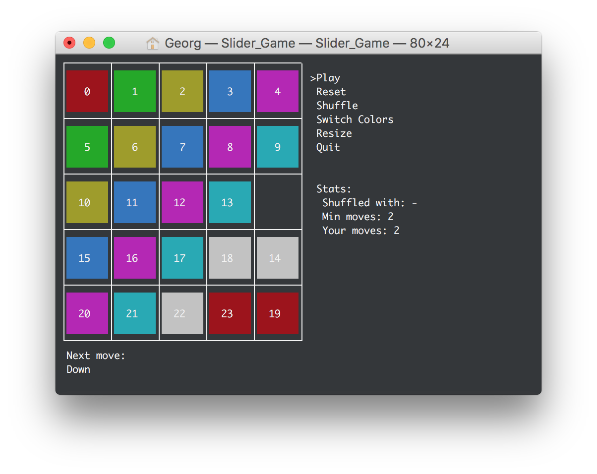

# Slider-Game
A small ncurses sliding game that uses an ITA* to help you solve the gamefield.
It includes features for assited solving, challange solving, shuffling, color modes,
different sizes and more.

# The GUI

The menu is simple and always on the right side of the gamefield.
  - <b>Play</b>
  - <b>Reset</b>
  - <b>Help / Shuffle</b> (depends if you're currently in play mode or not)
  - <b>Switch Colors</b>
  - <b>Resize</b> (resize the field to any size >=2)
  - <b>Quit</b>

Under the menu you can see the stats. Those ar the amount of moves used to shuffle the field, the minimum amount of solutions to solve it and your current move count.  
On the left side of the stats, under the gamefield, is the help bar. This message shows you the corresponding next move to solve the sliding puzzle in the most optimal way. This message is live updated, except you're currently in play mode and you didn't asked for help.  
Above that is the most important element of the game. The gaming field. The free tile represents the hole in the original game. You can only move tiles around that free field.

# Usage
Compile with <i>cmake</i>.
Use the game with w/a/s/d (up/left/down/right) to control the movement of the free tile and the arrow keys with the enter button to navigate in the menu.
To start a game press on <i>Play</i>, this will start a real game where you've a challenge. To just joke around use <i>Shuffle</i>, this will shuffle the game but will at the same time show you the live assistant. You can also mix the game up by yourself by just reseting the field and using the wasd keys.  
A small for tip to have a constant performance: Don't play on a field bigger than 5x5. The ITA* pathfinder will take there to long to find the perfect moves. The program uses multithreading so that it doesn't get into the way for the simple usage, but the advanced features will not be useable anymore.
